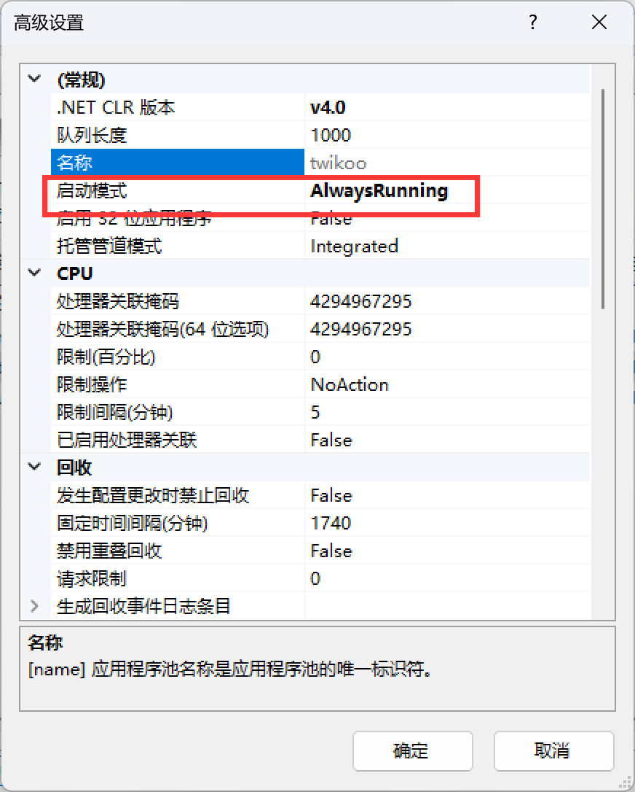

1、安装 node

2、安装 ASP.NET Core 运行时 Hosting Bundle
https://dotnet.microsoft.com/zh-cn/download/dotnet/thank-you/runtime-aspnetcore-8.0.0-windows-hosting-bundle-installer

3、iis对应程序池右键 高级设置  启动模式改为 AlwaysRunning
