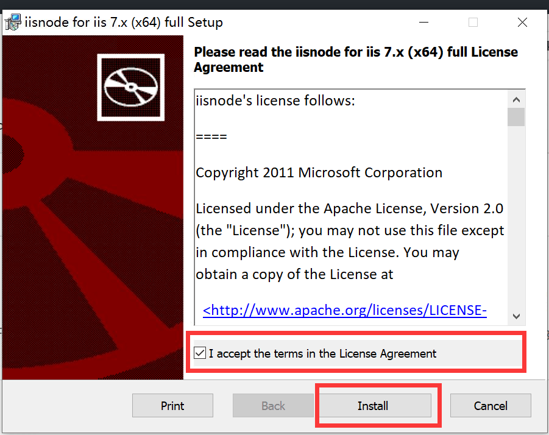

# iis 部署 twikoo

## 安装 iisnode

1、搜索控制面板

2、点击启用或关闭 windows 功能

3、安装 Internet Information Services 和 .NET Framework3.5(包括.NET2.0 和 3.0)

## 安装 node

下载地址: https://registry.npmmirror.com/-/binary/node/v18.18.2/node-v18.18.2-x64.msi

一直 next 即可，不会请自行百度

# 两种启动方式

## iisnode 启动

1、[下载 iisnode](https://github.com/Azure/iisnode/releases/latest)

下载 full x64 的

2、同意并安装

3、管理员运行 cmd

4、运行命令`cd C:\Program Files\iisnode && setupsamples.bat`,敲 3 次回车

5、[下载 url-rewrite](https://download.microsoft.com/download/1/2/8/128E2E22-C1B9-44A4-BE2A-5859ED1D4592/rewrite_amd64_zh-CN.msi)

6、运行
`C:\windows\system32\inetsrv\appcmd unlock config -section:system.webServer/handlers`和`C:\windows\system32\inetsrv\appcmd unlock config -section:system.webServer/modules`

7、打开 iis 管理器

8、点击网站,右键添加项目

9、主机名填你的域名

10、 在你的项目中运行`npm i`

11、打开你的网站，如果提示 iis 没有启动 node 的权限请在 Web.config 添加 nodeProcessCommandLine 到你的 node 路径

## aspNetCore 启动

1、[下载安装 aspNetCore](https://dotnet.microsoft.com/zh-cn/download/dotnet/thank-you/runtime-aspnetcore-8.0.0-windows-hosting-bundle-installer)

2、将 Web copy.config 内容覆盖 Web.config

3、打开 iis 管理器

4、点击网站,右键添加项目

5、在你的项目中运行`npm i`

# iis 配置

1、点击程序池 右键 高级设置 修改启动模式

2、右键 twikoo 管理网站 高级设置 启用预加载

# 运行效果

